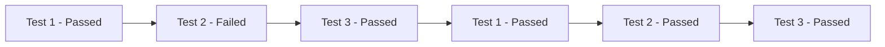
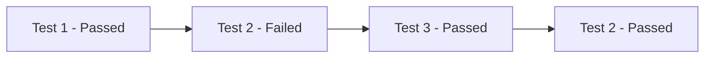

# End-to-End tests


These are the End-to-End (e2e) tests for the wallet mobile app. They run an emulator and simulate a user clicking through the app.

## Setting up the VM

### Android

First install the emulator as described in the [mobile readme](../README.md#optional-install-an-android-emulator).

By default, the e2e scripts will assume the VM name of `Pixel_API_29_AOSP_x86_64` recommended in the instructions but you can rename the VM as you like.

Next, to improve reliability of the tests, configure the VM as described in the [Setting Up an Android Development & Testing Environment](https://github.com/wix/Detox/blob/master/docs/Introduction.AndroidDevEnv.md).

### iOS

Ensure you have Xcode installed.

Install [AppleSimulatorUtils](https://github.com/wix/AppleSimulatorUtils#installing) which is used in e2e scripts to launch the iOS simulator.

### Setting up secrets for local runs

An `.env` example is present at `e2e/env.example` rename this file to `.env` and populate the secrets from Google Cloud Platform. Do not commit the newly created `e2e/.env` file.

## Running the tests

```sh
# Create your detox build various options present in the package.json
# Only needs to be built when app code changes - test code can be changed without a new build.
yarn run e2e:build:android-release

# (optional) - When running the e2e tests on a debug build the e2e packager should be run in a separate terminal first.
yarn run e2e:packager

# Run Detox
yarn run e2e:test:android-release
```

### CLI Options

[Detox CLI Options](https://github.com/wix/Detox/blob/master/docs/APIRef.DetoxCLI.md) can be passed directly to yarn.

```sh
# Running a specific test suite
yarn run e2e:test:android-release Pin.spec.js

# Running a specific test in a suite
yarn run e2e:test:android-release Pin.spec.js --testNamePattern "Then should be require PIN on app open"

# Reusing an existing app install
yarn run e2e:test:android-release --reuse
```

### Retries

Retries in Detox can be used at the suite level across all the tests as done in CI with `e2e:test:android-release --retries 3` or on a test level by placing `jest.retryTimes(3)` above a test or describe block; These retry methods have fundamentally different behavior.

#### Suite Level Retries

Using the `--retries` CLI flag will retry an entire suite in order.



#### Test Level Retries

Using `jest.retryTimes(3)` above a test spec or describe block will retry the failed tests after the others complete.



## e2e tests in Detox

For most e2e tests you need to do three things:

- Find elements using `element(by.id('SomeTestID'))`: Give the element you want to find a testID so they can be reliably found on the screen
- Perform actions on the element, such as `element.tap()` or `element.typeText('Some Text')`. Detox will automatically wait for these actions to finish.
- Test properties of the element using expectations, such as `expect(element).toBeVisible()`. You will mostly need `.toBeVisible()` and `.toHaveText()`.

```javascript
it('has a button to select the language', async () => {
  await element(by.id('ChooseLanguage/en-US')).tap()
  await element(by.id('ChooseLanguageButton')).tap()
  await expect(element(by.id(`ButtonSkipToInvite`))).toBeVisible()
})
```

Detox will now look for an element with the testID 'ChooseLanguage/en-US' and then tap on it. Detox will automatically wait for the app to react to the action. Since we are performing an action with this test, this is an 'actions' test.
After english was selected, detox will tap the button to submit our language of choice. Detox will now wait until the next screen (the sync screen). On that screen is a button to skip to the Invite screen, and the last line checks that the button is there. If the button is there, we know that pressing the 'ChooseLanguageButton' worked.

The function needs to be `async`, and you will need to `await` all calls to detox functions.

For more information about Detox, check out the [API reference](https://github.com/wix/Detox/blob/master/docs/README.md#api-reference)

## Adding a test

The main test files are on the root of the e2e/src directory. Test suites call the specific use cases, which live in the [usecases](./src/usecases) directory.

In the [usecases](./src/usecases) directory, create new `<usecase>.js` or add an it-block to an existing appropriate use case.

If creating a suite of tests, add a new `<TestSuiteName>.spec.js` file following the format of [AccountSupport.spec.js](./src/AccountSupport.spec.js).

While developing and adding new tests, it's useful to run only the ones we are working on and not go through the onboarding on each run. To do this, use the following strategy.

```sh
# First create your Detox test build
yarn e2e:build:android-release

# Second run your test case and suite
yarn e2e:test:android-release sample-suite.spec.js -t "Test Name"

# For subsequent test runs reuse your existing install to avoid onboarding at the start of every run
yarn e2e:test:android-release sample-suite.spec.js -t "Test Name" -r
```

### Example test suite and use case

```JavaScript
// Sample <TestSuiteName>.spec.js setup
import { quickOnboarding, getDeviceModel } from './utils/utils'
import { reloadReactNative } from '../utils/retries'

import AddedUsecase from './usecases/AddedUsecase'

describe('A New Test Suite', () => {
  beforeAll(async () => {
    // Restores the test account if needed
    await quickOnboarding()
  })

  describe('A New Usecase', AddedUsecase)
})
```

```JavaScript
// Sample <UseCase>.js
export default AddedUsecase = () => {
  beforeEach(async () => {
    // Reload app on device
    await reloadReactNative()

    // Example setup steps for every test spec in this usecase
    await element(by.id('Hamburger')).tap()
    await element(by.id('add-and-withdraw')).tap()
    await element(by.id('addFunds')).tap()
  })

  // Sample test spec / it block
  it('Display Providers', async () => {
    // Test spec specific steps
    await element(by.id('GoToProviderButton')).tap()
    await element(by.id('FiatExchangeInput')).replaceText('$50')
    await element(by.id('FiatExchangeNextButton')).tap()

    // Assertions - check that all providers are visible
    await expect(element(by.id('Provider/Moonpay'))).toBeVisible()
    await expect(element(by.id('Provider/Simplex'))).toBeVisible()
    await expect(element(by.id('Provider/Xanpool'))).toBeVisible()
    await expect(element(by.id('Provider/Ramp'))).toBeVisible()
    await expect(element(by.id('Provider/Transak'))).toBeVisible()
  })

  it('Additional Test Spec...', async () => {
    // Additional test spec starting after 'addFunds' tap
  })
}
```

## Adding TestIDs

A TestID is a unique string that you should give to the components you want to test. The build-in components from react native support adding testIDs like this:

```jsx
<button testID='SubmitButtonOnPaymentScreen'>
```

You should make your testIDs unique by describing the purpose of the element with reference to the screen it is on.

### Adding TestIDs to custom components

Usually, you will want to pass the testID as a prop from your custom component to some child component. Sometimes it makes sense to automatically generate the testID based on existing props. If you need to identify multiple child components, you should generate their testID from the testID of your custom component, for example:

```jsx
class ExampleInput extends React.Component {
  render() {
    return (
      <View testID={this.props.testID}>
        <Field testID={`${this.props.testID}/InputField`} />
        <Button testID={`${this.props.testID}/SubmitButton`} />
      </View>
    )
  }
}
```

It is recommended to follow the scheme parentID/ChildDescription.

## Setting remote config defaults for e2e tests

We do not read remote config values from firebase for e2e tests, so default remote config values are used. A custom set of remote config
defaults may be needed for some tests which differs from production configuration. For example, in production code,
we do not wish to show FiatConnect cash-outs by default, but to test FiatConnect cash-outs end-to-end, we need
`fiatConnectCashOutEnabled` to be `true`.

To set remote config values specifically for end-to-end tests, see `remoteConfigValuesDefaults.e2e.ts` and make
whatever changes are needed there.

## The e2e banner

In the readme files, wallet root and this one, there are banners for the e2e tests. The test status is saved in GitHub Actions [E2E](https://github.com/valora-inc/wallet/actions/workflows/e2e-main.yml)

There are reports for ci e2e runs and an additional artifacts for failing runs. These reports can be accessed from Actions > Android E2E or iOS E2E > select a run.

## Troubleshooting

If tests are failing for unknown reasons:

- Rebuild, re-yarn and rerun. Sometimes the problem just goes away.
- Delete snapshots in the emulator
- Look at the emulator while the tests are running. Can you see anything obvious going wrong?
- If running into issues building for iOS related to nvm try prefixing the build commands in `package.json` with `unset PREFIX && ...`

### Sample `.zshrc` & `.bashrc`

```sh
export GOPATH=$HOME/go
export PATH=$PATH:$GOPATH/bin
export GEM_HOME="$HOME/.gem"
export ANDROID_HOME="$HOME/Library/Android/sdk"
export ANDROID_NDK="$HOME/Library/Android/sdk/ndk"
export ANDROID_SDK_ROOT="$HOME/Library/Android/sdk"
export GRADLE_OPTS='-Dorg.gradle.daemon=true -Dorg.gradle.parallel=true -Dorg.gradle.jvmargs="-Xmx4096m -XX:+HeapDumpOnOutOfMemoryError"'
export ANDROID_AVD_HOME="$HOME/.android/avd"
export PATH=$ANDROID_HOME/emulator:$ANDROID_HOME/tools:$PATH

# nvm things: use `setopt interactivecomments` in your terminal to allow comments in the .zshrc
export NVM_DIR="$HOME/.nvm"
[ -s "$NVM_DIR/nvm.sh" ] && \. "$NVM_DIR/nvm.sh"  # This loads nvm
[ -s "$NVM_DIR/bash_completion" ] && \. "$NVM_DIR/bash_completion"  # This loads nvm bash_completion
```
