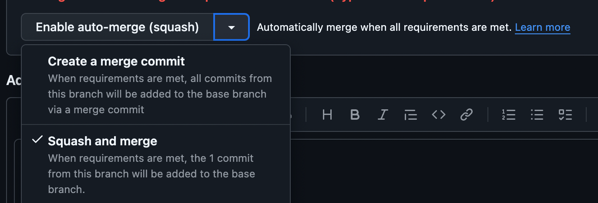
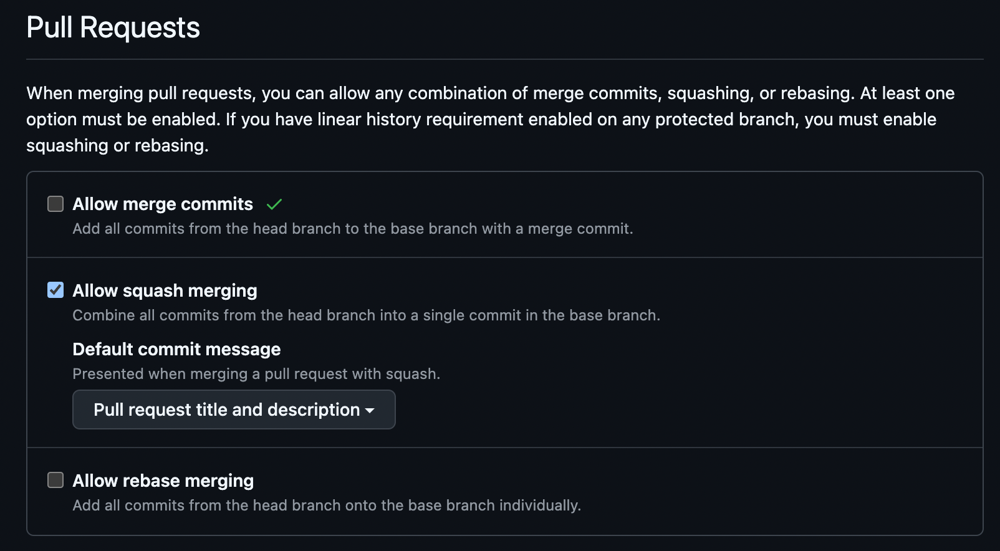

# Syncing Forks

Periodically you'd need to sync forked repos with the base repo (either pulling
in changes from Valora into mobilestack-runtime or from mobilestack-runtime to another mobile
stack app). There are multiple ways to do it, the below documents one way that
helps maintaining commit history and makes pulling future changes easier.

## One time setup

First, if you're not a member of the [mobilestack-xyz](https://github.com/mobilestack-xyz) org on GitHub,
reach out to a member of the Valora engineering team for an invitation.

### Pull forked repo to your local machine

```console
# could be MS runtime or another MS app
$ git clone git@github.com:mobilestack-xyz/mobilestack-runtime.git
```

### Add upstream remote repository

On the root of the forked repository

```console
# if pulling changes from Valora to MS runtime
$ git remote add upstream git@github.com:valora-inc/wallet.git

# if pulling MS runtime into another MS app
$ git remote add upstream git@github.com:mobilestack-xyz/mobilestack-runtime.git
```

## Syncing forks

### Ensure local repo is up to date

On the root of the forked repository

```console
$ git fetch origin
$ git fetch upstream
$ git checkout main
$ git pull origin main
```

### Create branch

Create a backup branch for main in case anything goes wrong. You can also do
this directly on github

```console
$ git checkout -b main-backup
```

Create a branch for syncing changes

```console
# rename branch as required (e.g., prefixing your user id)
$ BRANCH_NAME=<user-id>/sync-fork
$ git checkout -b $BRANCH_NAME
```

### Merge upstream changes and resolve conflicts

```console
$ git merge upstream/main
```

If there are any conflicts, resolve them manually and commit the merge. The
default merge commit is named `Merge branch 'source-branch' into
'destination-branch'`, rename this to follow conventional commit format. E.g.,
`chore: sync with [valora/mobilestack-runtime]`

If you accidentally commit with the default message, you can edit the message by
running the below, which would present you a text editor to update the commit message

```console
$ git commit --amend
```

### Open a pull request

Push the remote branch and open a pull request on github. Make sure to include
conflicted filenames in the PR description to make it easier for reviewers.

```console
$ git push origin $BRANCH_NAME
```

### Merge pull request

Once the PR is approved, merge the pull request using the `Create a merge
commit` option:



This is off by default and you'd need to enable `Allow merge commits` in the
repo settings (make sure to select "Pull request title and description" as the
default commit message so it follows conventional commit format when merging):



If merge queue is on, you will also need to disable it since merge queue uses squash and merge by default. Merge queue can be turned off in Settings => Rules => Rulesets => main => Require Merge Queue.

You'll get a red error message saying the repository requires linear history and
doesn't allow merge commits. You can ignore this message and continue with the
merge.

A successful merge would mean that at the root of the repo, you'll see the
message that says `This branch is X commits ahead of <base-repo>`. You should
not see `Y commits behind`.

Once you've merged, you can disable `Allow merge commits` option in the settings
so other PRs are only merged using the `Squash and merge` option. Turn back on merge queue using `Squash and merge` as the default setting.

## Fixing bad merges

In case something went wrong with the sync, (e.g., fork is still behind base
repo, used squash and merge instead of merge commit, etc.), you can rewrite git
commit history to clean bad merges.

> 🚨 This involves force pushes so be extra careful when doing this. Only
> attempt to do this if the sync is the latest commit and there are no new
> additional commits on top of it. Get help from the engineering team if you're
> unsure of any of this. 🚨

### Reset local main to backup main

```console
$ git checkout main
$ git fetch origin
$ git pull origin main
$ git checkout -b main-synced-backup
$ git checkout main
$ git reset --hard main-backup
```

### Force push main

Force pushes are off by default. You'll need to enable this by changing two
settings:

- Enable `Allow force pushes` in branch protection settings.
  - Navigate to settings -> Branches -> Edit branch protection rules
- Disable `Block force pushes` in branch rulesets
  - Navigate to settings -> Rules -> Rulesets -> main

Once the settings are updated, run the following command:

```console
$ git push --force origin main
```

Once this is complete, revert the settings changes done above so that force
pushes are no longer allowed.

The main branch should now be in the state before the sync, you can follow the
steps from above to do a fresh sync.
